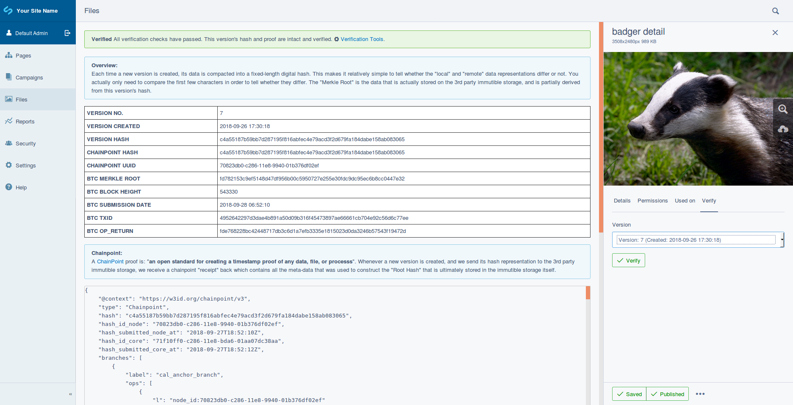

# SilverStripe Verifiable

[](https://travis-ci.org/phptek/silverstripe-verifiable)
[](https://scrutinizer-ci.com/g/phptek/silverstripe-verifiable/?branch=master)
[](https://github.com/phptek/silverstripe-verifiable/blob/master/LICENSE.md)

## What is this?

A configurable content verification module for SilverStripe applications. It provides independent data-integrity verification features to content authors and developers. Data can be verified independently of SilverStripe and at any time.

## Background

For decades users of software have taken it for granted that their stored data is safe from tampering. That developers, vendors and database administrators are above making unauthorised manual or automated content modifications, regardless of any mal-intent. Simply put: Users have put their faith into these entities for no real reason other than they probably sounded like they knew what they were doing.

Because no I.T. system can claim immutability, this module therefore offers verifiability; data who's integrity is mathematically provable at any point in time. If some data were to change when it wasn’t supposed to, then those that need to know, can.

The identification of unwarranted behaviour and negative outcomes is not the only application of verifiability. Verifiability is a research domain of its own closely aligned with those of the decentralisation movement typified by cryptocurrencies and enterprise blockchain networks. Verifiability is also concerned with transparency in the context of public data, and accountability.

By default, without any specialist configuration; the module offers a simple admin interface that allows the content of a specific version of any [versioned](https://github.com/silverstripe/silverstripe-versioned) `DataObject`, to be verified as not having changed since it was published.

## How does it work?

With the most basic configuration; on each write-operation, a sha256 hash of selected field-data is created and submitted to a 3rd party backend that implements a [Merkle or Binary Hash Tree](https://en.wikipedia.org/wiki/Merkle_tree). The true power of this module however comes with giving developers the ability to supply their own data to be hashed and submitted. All developers need to do is declare a `verify()` method on any decorated and [versioned](https://github.com/silverstripe/silverstripe-versioned) `DataObject` subclass, and the module will call it on every write. Uses of this method might be to notarise uploaded `File` objects or use SilverStripe to become the next [NewsDiffs](https://newsdiffs.org/). See the configuration section below. 

The two systems that we are aware of that fit the bill as servicable Merkle backends are; public blockchains (notably Bitcoin and Ethereum) and standalone or clustered Merkle Tree storage systems like [Trillian](https://github.com/google/trillian/).

In addition to processing and persisting value-based transactions in their native cryptocurrencies, the Bitcoin and Ethereum blockchains are also capable of storing arbitrary data of a limited size. This makes them ideal for storing Merkle Root hashes from which individual "leaf" hashes can be mathematically derived. The module makes use of REST calls to the [Chainpoint](https://chainpoint.org/) Network. Chainpoint periodically writes Merkle Root hashes to the Bitcoin blockchain.




## Requirements

* At least PHP7 and SilverStripe 4.
* Your PHP setup also needs Zlib and [msgpack](https://msgpack.org/). These are required to decode the binary format proof returned from most Tierion REST API calls, into a valid JSON-LD v3 Chainpoint Proof.

## Install

    #> composer require phptek/verifiable

## Configuration

Configure the desired backend:

```YML
PhpTek\Verifiable\Backend\VerifiableServiceFactory
  # One of: "trillian" or "chainpoint"
  backend: chainpoint
```

Add the `VerifiableExtension` to each data-model that you'd like to be "Verifiable":

```YML
My\Name\Space\Model\MyModel:
  extensions:
    - PhpTek\Verifiable\Model\VerifiableExtension
```

And for SilverStripe 4 `File` classes:

```YML
SilverStripe\Assets\File:
  extensions:
    - SilverStripe\Versioned\Versioned
    - PhpTek\Verifiable\Model\VerifiableExtension
SilverStripe\Assets\Image:
  extensions:
    - SilverStripe\Versioned\Versioned
    - PhpTek\Verifiable\Model\VerifiableExtension
SilverStripe\AssetAdmin\Forms\FileFormFactory:
  extensions:
    - PhpTek\Verifiable\Model\VerifiableFileExtension
```

By default, any fields on your decorated model(s) that you define in the `verifiable_fields` array, will be hashed and submitted to the backend thus:

```YML
My\Name\Space\Model\MyModel:
  verifiable_fields:
    - Title
    - Content
```

You can supply your own data to be hashed and submitted. Developers simply declare a `verify()` method on any `DataObject` subclass that is decorated with `VerifiableExtension`, and its return value will be hashed and submitted to the backend. E.g:

```PHP
class MyDataObject extends DataObject
{

    /**
     * Take the contents of a file for a basic form of digital notarisation.
     * 
     * @param string $filename 
     * @return string
      */ 
      public function verify(string $filename) : string
      {
            return file_get_contents($filename);
      }

}

```

Be sure to run `flush=all` via your browser or the CLI to refresh SilverStripe's YML config cache.

To view generated SVG Chainpoint visualisations in the admin UI, you'll need to ensure that `svg` is a legitimate file-suffix to use in SilverStripe
by editing `public/assets/.htaccess` (Apache users only).

You'll also need to install a simple cron job on your hosting environment which invokes `UpdateProofController`. This will do the job of periodically querying the backend for a full-proof (Chainpoint backend only).

    ./vendor/bin/sake verifiable/tools/update

## Background Reading

* [Trustworthy technology: The future of digital archives](https://blog.nationalarchives.gov.uk/blog/trustworthy-technology-future-digital-archives/)
* [Xero Integrates With Tierion To Secure Accounting Data Using Chainpoint](https://blog.tierion.com/2018/04/19/xero-integrates-with-tierion-to-secure-accounting-data-using-chainpoint/)
* [The Chainpoint Protocol](https://chainpoint.org/)
* [The ChainPoint Whitepaper](https://github.com/chainpoint/whitepaper/blob/master/chainpoint_white_paper.pdf)
